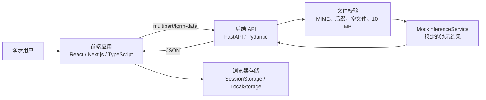
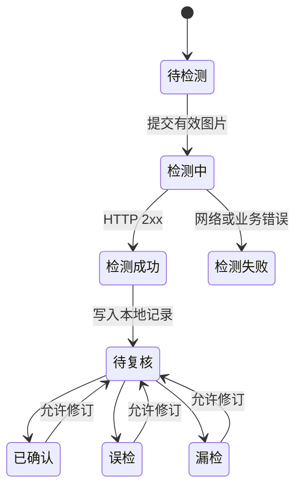

# 03 系统架构与开发基线

## 1. 文档目的与版本

| 项目 | 内容 |
| --- | --- |
| 系统名称 | SteelVision 热轧钢带划痕检测与质量追溯平台 |
| 文档版本 | `V1.0-开发基线` |
| 适用范围 | 计算机设计大赛演示系统开发、联调、测试与答辩 |
| 关联文档 | [07-接口说明](07-接口说明.md)、[11-测试与排错](11-测试与排错.md) |

本文档将内容区分为两类：**本次必须实现**是开发验收依据；**后续扩展**只说明边界，不得在答辩中表述为已实现能力。

## 2. 建设目标与范围

### 2.1 建设目标

完成一个可独立启动、可现场演示的 Web 系统，展示“图片输入—服务端校验—检测结果展示—人工复核—本地历史追溯”的闭环。后端采用可替换的 Mock 推理服务，保证接口、页面和流程可在没有数据集、模型权重或训练环境时运行。

### 2.2 本次必须实现

| 编号 | 能力 | 验收口径 |
| --- | --- | --- |
| F-01 | 演示登录 | 使用固定演示账号进入系统；未登录时访问业务页应跳转登录页 |
| F-02 | 服务状态 | 前端可显示后端“可用 / 不可用”状态；后端提供健康检查 |
| F-03 | 单图检测 | 支持 JPG/JPEG/PNG 的选择、拖拽、预览、阈值设置、提交和结果展示 |
| F-04 | 文件保护 | 前后端均限制图片类型与 10 MB 大小；后端还须校验扩展名和空文件 |
| F-05 | 批量检测 | 单批最多 20 张；逐张请求；展示成功、失败、处理中数量，允许部分成功 |
| F-06 | 摄像头单帧 | 仅调用浏览器摄像头预览；用户主动截取一帧后按单图接口提交，不上传连续视频 |
| F-07 | 结果可视化 | 在原图等比例叠加检测框；展示类别、置信度、阈值、模型版本、耗时和 `mock` 标识 |
| F-08 | 人工复核 | 支持待复核、已确认、误检、漏检四种状态；可填写不超过 200 字的说明 |
| F-09 | 本地追溯 | 浏览器刷新后仍可查询本浏览器中的检测与复核记录；支持按名称、来源、复核状态筛选 |
| F-10 | 异常反馈 | 对无效文件、网络失败、摄像头拒绝、空结果等情形给出明确且可恢复的提示 |

### 2.3 不在本次范围

- 数据集收集、数据标注、数据清洗、数据划分与模型训练、评测。
- 真实模型权重、GPU 推理、精度、召回率、FPS 或生产质量结论。
- 数据库、对象存储、服务端正式记录、订单、排产、库存等外围系统。
- 服务端用户体系、真实角色权限、审计日志、连续视频流、WebSocket 和多摄像头调度。

> 本次的“追溯”仅指当前浏览器 LocalStorage 中的演示记录，不能替代生产环境的质量追溯档案。

## 3. 使用角色与页面边界

| 角色 | 本次实现方式 | 可用功能 |
| --- | --- | --- |
| 演示用户 | 固定账号 `admin / admin123`，SessionStorage 保存登录状态 | 全部演示页面 |
| 质检人员 | 演示用户在业务上的使用身份，不单独实现账号 | 检测、查看结果、人工复核、查询本地历史 |
| 管理员 | 不单独实现服务端账号和权限 | 查看工作台及模型说明 |

页面路由与职责：

| 页面 | 主要内容 | 关键状态 |
| --- | --- | --- |
| 登录页 | 账号校验、进入系统 | 登录失败提示、登录中 |
| 工作台 | 服务状态、累计检测数、待复核数、最近记录 | 后端在线状态 |
| 单图检测 | 上传区、阈值、预览、结果框、复核区 | 空闲、预览、提交中、成功、失败 |
| 批量检测 | 文件列表、逐项进度、汇总统计 | 待提交、处理中、部分成功、完成 |
| 摄像头演示 | 摄像头预览、授权提示、截帧、检测结果 | 未授权、预览中、截帧处理中、失败 |
| 历史记录 | 本地记录列表、筛选、详情、复核更新 | 空列表、有记录、筛选无结果 |
| 模型说明 | 当前 `mock` 状态、统一结果协议与替换边界 | 静态展示 |

## 4. 总体技术架构



### 4.1 职责划分

| 层次 | 负责内容 | 不负责内容 |
| --- | --- | --- |
| 前端 | 页面交互、预览、表单校验、请求状态、SVG 叠框、本地历史与复核 | 可信的文件判定、正式鉴权、推理逻辑 |
| 后端接口 | 请求接收、强制文件校验、参数校验、统一错误响应 | 页面状态、浏览器存储 |
| 推理服务 | 返回符合统一协议的稳定 Mock 结果 | 训练、模型评测、数据持久化 |
| 浏览器存储 | 演示登录状态、检测记录、复核状态 | 跨用户同步、服务端审计、正式追溯 |

### 4.2 目录约定

```text
steel-scratch-web/
├── frontend/                 # React 前端
│   ├── app/                  # 页面、布局和客户端逻辑
│   ├── public/               # 静态资源
│   └── tests/                # 前端检查
├── backend/
│   └── app/
│       ├── routers/          # HTTP 路由
│       ├── schemas/          # Pydantic 请求/响应模型
│       └── services/         # 文件校验与推理服务
└── docs/                     # 项目文档
```

## 5. 核心设计约束

### 5.1 统一检测结果协议

后端应始终返回 `record_id`、文件名、创建时间、模型信息、预测列表、推理耗时、阈值、来源和运行模式。坐标使用原图宽高的 **0–100 百分比**，而不是浏览器像素，前端据此缩放叠框。

每个预测框必须满足：

- `0 <= x1 < x2 <= 100`，`0 <= y1 < y2 <= 100`；
- `confidence` 范围为 0–1；
- 前端仅显示 `confidence >= threshold` 的预测框；
- `predictions` 允许为空，空数组应显示“未发现划痕候选（Mock 结果）”，而不是报错。

### 5.2 检测、复核与本地历史状态



复核操作只修改对应本地记录，不改变后端的原始推理响应。每次修改记录 `reviewed_at` 和 `review_remark`，以便历史页显示最新结论。

### 5.3 浏览器存储约定

| 存储位置 | 键名建议 | 生命周期 | 内容 |
| --- | --- | --- | --- |
| SessionStorage | `steelvision.session` | 关闭标签页或退出登录后失效 | 演示登录状态、用户名 |
| LocalStorage | `steelvision.records.v1` | 当前浏览器主动清除前保留 | 检测响应、缩略图引用/文件名、复核状态、复核说明 |

本地记录最多保留 200 条；写入第 201 条时按创建时间移除最早记录。解析失败或版本不兼容时，页面应提示用户清理本地演示记录，不得导致页面崩溃。

## 6. 关键交互规则

### 6.1 文件上传

1. 前端先校验 MIME 类型与文件大小，失败时不发送网络请求。
2. 后端必须再次校验，不信任前端传参。
3. 一次单图请求只接受 1 个文件；批量页面按文件逐一调用该接口。
4. 请求期间禁用重复提交；完成、失败或取消后恢复可操作状态。
5. 选择新图片后清空上一张的预测框和复核编辑状态，避免结果错配。

### 6.2 摄像头

- 仅在安全上下文（`localhost` 或 HTTPS）请求 `getUserMedia`。
- 默认使用环境摄像头；不可用时回退为浏览器选择的可用摄像头。
- 退出页面、关闭预览或重新打开摄像头时停止全部 MediaStream track。
- 用户拒绝授权时给出说明并提供“改用本地上传”的入口。

### 6.3 错误显示

| 场景 | 前端提示原则 | 用户可采取的动作 |
| --- | --- | --- |
| 400 | 文件为空或无有效内容 | 重新选择文件 |
| 413 | 图片超过 10 MB | 更换或压缩图片 |
| 415 | 文件格式不支持 | 选择 JPG/JPEG/PNG |
| 422 | 阈值、来源或字段不合法 | 恢复默认参数后重试 |
| 网络错误 / 5xx | 后端待连接或服务异常 | 检查服务状态并重试 |
| 无预测框 | 正常展示空结果 | 可进行“漏检”复核 |

## 7. 安全与运行要求

本次演示仅提供最小安全保护：后端限制文件类型、扩展名、空文件和 10 MB，前端限制可选文件，CORS 仅允许本地开发前端地址。固定账号不能视为真实认证，LocalStorage 数据可被用户修改或删除。

开发时必须做到：

- 任何环境变量、密码、令牌和真实图片不得提交到 Git；
- 错误信息不得返回文件系统绝对路径、堆栈或密钥；
- 后端不将上传文件写入磁盘；
- `mode: mock` 必须在页面与接口响应中可见；
- 生产部署或真实业务接入前另行补充 HTTPS、服务端认证、权限、审计、存储和频率限制设计。

## 8. 配置、部署与可观测性

| 配置项 | 示例 | 作用 |
| --- | --- | --- |
| `NEXT_PUBLIC_API_BASE_URL` | `http://127.0.0.1:8000` | 前端调用的后端地址 |
| 后端端口 | `8000` | FastAPI 监听端口 |
| 前端开发端口 | `5173` | 本地开发服务端口 |
| 上传上限 | `10485760` 字节 | 前后端统一的 10 MB 限制 |

现场演示前必须完成：启动前后端、访问 `/health`、打开 Swagger、完成一次单图检测、完成一次摄像头截帧（若设备可用）、刷新历史页确认本地记录仍存在。后端至少记录请求时间、路径、状态码和异常摘要；日志不得记录图片二进制内容。

## 9. 验收清单

| 类别 | 必测项目 | 通过标准 |
| --- | --- | --- |
| 登录 | 正确/错误账号、退出、直接访问业务页 | 正确进入，错误提示，退出后被拦截 |
| 单图 | JPG、PNG、错误格式、空文件、超限文件 | 合法文件出结果；非法文件有正确提示 |
| 批量 | 1 张、20 张、混有非法文件 | 合法图片继续处理，统计成功和失败数量 |
| 摄像头 | 授权、拒绝、截帧、离开页面 | 可截帧检测；拒绝可恢复；离开后释放摄像头 |
| 结果 | 有框、无框、不同阈值 | 叠框位置随图片缩放正确，空结果正常展示 |
| 复核与历史 | 四种状态、说明、刷新、筛选 | 修改可保存并在刷新后保留；筛选结果正确 |
| 接口 | `/health`、`/system/info`、`/inferences` | 状态码、字段和错误格式符合接口文档 |
| 边界声明 | 页面、模型页、答辩材料 | 明确标识 `mock`，不展示虚构性能或生产能力 |

## 10. 后续扩展边界（不纳入验收）

真实模型接入时，只允许替换服务层实现并保持本次响应协议兼容；后续若增加数据库、对象存储、异步任务、服务端认证或实时推送，必须单独新增需求、数据、安全和接口文档，不能直接视为本次功能的自然延伸。
